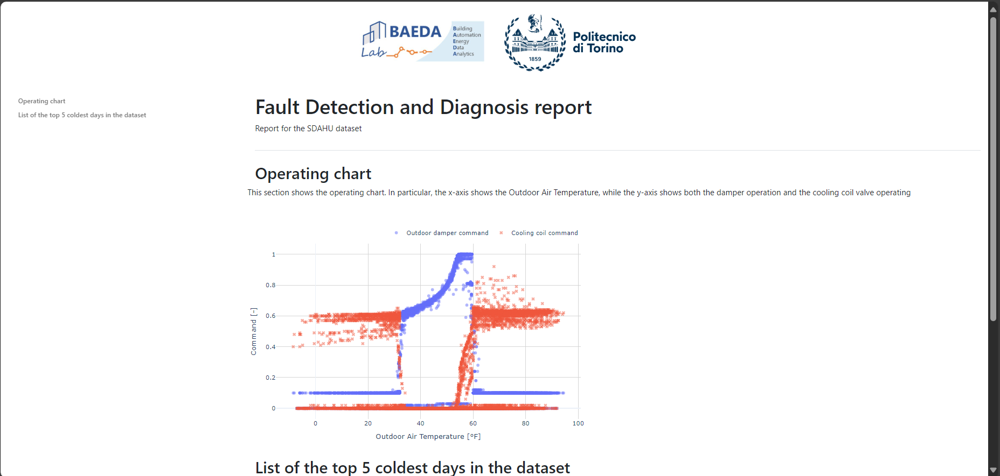

# Interactive HVAC report with Jinja2
This project is an example on how to structure a project for creating an interactive report for HVAC systems using Jinja2 and Python.



### Repository structure

The structure of the repository is organized as follow:

- `data/`: Contains the data used for generate images and analysis in the report.
- `static/`: Contains the static files like images, css, and javascript, used for the report.
- `templates/`: Contains the html templates used.
- `reports/`: Contains the generated reports.
- `src/`: Contains the Python source code for generating the report. It can be structured anyway you want. In this case, it is structured as follow:
  - `src/report.py`: The script for generating and rendering the report.
- main.py: The main script for running the report generation.

### Project initialization and setup
- Clone the project from the repository:
    ```bash
  git clone https://github.com/Giudice7/example_interactive_HVAC_report
    ```

- Open the terminal and move to the project folder.
    ```bash
  cd REC_sharing_mechanism
    ```

- Check the python version installed:
    ```bash
  python --version
    ```

    In this project, Python 3.11 was used, so it is recommended to use the same version to avoid compilation problems. If you have a different version, download the 3.11 from the following [link](https://www.python.org/downloads/release/python-3110/).

- Create a virtual environment (venv) in the project folder:
    ```bash
    python -m venv venv
    ```
- Activate the virtual environment:
    ```bash
    venv/Scripts/activate
    ```
- Install dependencies:
    ```bash
    pip install -r requirements.txt
    ```

### Contributors:
- [Rocco Giudice](rocco.giudice@polito.it)
- [Roberto Chiosa](roberto.chiosa@polito.it)